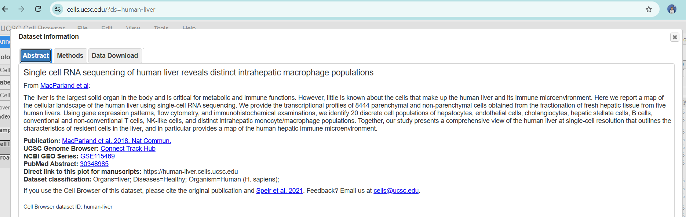
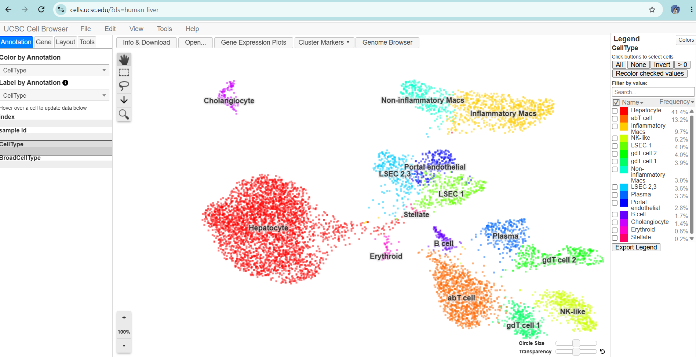
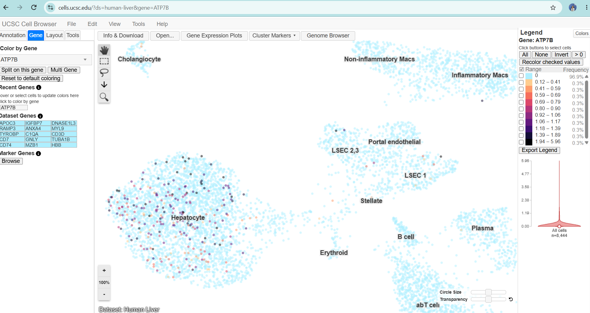
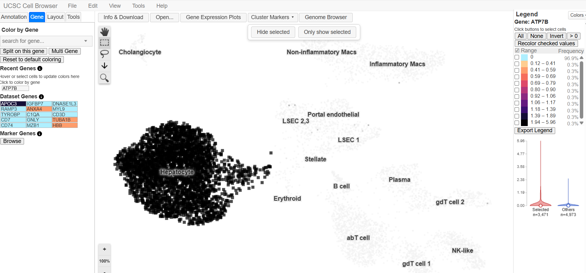
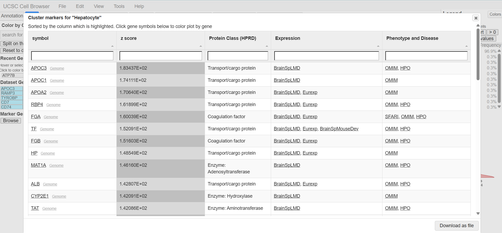

# Junavhel Jane B. Olaguir
# UCSC Cell Browser Activity
From Genome to Cell: Exploring Disease Gene Using the UCSC Cell Browser

# 1. Assigned Gene and Disease
Gene: ATP7B

Disease: Wilson disease

# 2. Organ/Tissue Choice and Dataset Information

# Selected Dataset

**Dataset:** Human Liver  
**Dataset ID:** `human-liver`  
**Organ/Tissue:** Liver  
**Organism:** Human (*Homo sapiens*)  
**Disease Classification:** Healthy  

**Study:** *Single cell RNA sequencing of human liver reveals distinct intrahepatic macrophage populations*

**Publication:** MacParland et al. (2018), *Nature Communications*  
**NCBI GEO Series:** GSE115469  
**PubMed:** 30348985  

**Dataset URL:** https://cells.ucsc.edu/?ds=human-liver  
**Direct Plot:** https://human-liver.cells.ucsc.edu

# Reason for Dataset Selection

The Human Liver dataset was selected because ATP7B is associated with Wilson disease, a disorder involving abnormal copper accumulation that prominently affects the liver. Examining ATP7B expression in human liver cells allows its expression pattern to be investigated across hepatocytes and other liver cell populations.

The dataset is classified as healthy, so the results represent ATP7B expression in healthy human liver cells rather than cells from individuals with Wilson disease.

# Screenshot 1 — Selected Dataset

# 3. Understanding the Cell Map

**a. What type of visualization is being shown?**

The Human Liver dataset displays a **t-SNE (t-distributed stochastic neighbor embedding) projection**. This visualization represents relationships among cells based on their transcriptomic profiles.

**b. What Does One Dot Represent?**

Each dot represents **one individual cell** profiled using single-cell RNA sequencing. Cells located near one another generally have more similar overall gene-expression profiles than cells positioned farther apart.

**c. What do the clusters represent in this particular dataset?**

The clusters represent groups of cells with similar transcriptomic profiles and correspond to different cell types or cellular populations in the human liver.

**d. List at least three cell-type or cluster labels visible in the dataset.**

- Hepatocyte
- Inflammatory Macs
- Non-inflammatory Macs
- LSEC 1
- Portal endothelial
- Cholangiocyte
- Stellate
- B cell
- Plasma
- NK-like

# 4. Assigned Gene Expression

**a. Assigned gene symbol** 
ATP7B

**b. Dataset used** 
Human Liver** *human-liver*

**c. Expression pattern** 
Low/undetected and relatively restricted. The expression legend shows that 96.9% of cells have an expression value of 0, while only a small fraction show detectable ATP7B expression.

**d. Cluster(s) with stronger expression**
Hepatocyte shows the most noticeable concentration of detectable ATP7B expression, with scattered higher-expression cells visible within the cluster.

**e. Cluster(s) with little or no detectable expression** 
Little or no detectable expression is observed across most other cell populations, including cholangiocytes, non-inflammatory macrophages, inflammatory macrophages, LSEC 1, LSEC 2/3, portal endothelial cells, stellate cells, B cells, plasma cells, abT cells, gdT cells, and NK-like cells.

# Interpretation

ATP7B expression in the selected Human Liver dataset is low/undetected in most cells, with detectable expression appearing mainly within the hepatocyte cluster. The expression pattern is therefore not widespread across the entire cell map. This observation is based only on the selected healthy Human Liver single-cell dataset and does not indicate that ATP7B is absent from other tissues or cell types.

# Screenshot 2 — Gene Expression Cell Map

The screenshot below shows the t-SNE cell map of the Human Liver dataset with the annotated cell-type clusters.

# 5. Cell Types and Clusters Expressing ATP7B
# ATP7B Expression by Cell Type

**Strongest visible expression** 
Hepatocyte

**Another cell type with detectable expression** 
Inflammatory macrophages (Inflammatory Macs)

**Relatively low/undetected expression** 
Cholangiocytes and most other cell populations

**Overall expression pattern** 
Low/mostly undetected and relatively cell-type restricted

# Interpretation

ATP7B expression is most visibly concentrated in the **hepatocyte cluster**, where numerous cells show detectable expression at varying levels. A smaller number of cells with detectable ATP7B expression are also observed in the **inflammatory macrophage (Inflammatory Macs)** cluster, although the signal is less prominent than in hepatocytes.

Overall, ATP7B expression appears **low or undetected in most cells and relatively restricted to specific cell populations**, particularly hepatocytes. This interpretation is based only on the selected **healthy Human Liver dataset** and should not be generalized to other tissues, datasets, or disease conditions.

# Screenshot 3 — ATP7B Expression Across Cell Types

The screenshot below shows the ATP7B expression map together with the annotated cell-type clusters. The strongest visible concentration of ATP7B-expressing cells occurs in the hepatocyte population.

# 6. Expression Plot

**Selected Cell Population**

The **hepatocyte cluster** was selected because it showed the strongest visible ATP7B expression in the cell-expression map. A total of **3,471 hepatocyte cells** were selected and compared with **4,973 other cells** in the dataset.

**ATP7B Expression Comparison**

The violin plot shows that the selected hepatocyte cells have a **higher ATP7B expression distribution** compared with the other cells. The selected-cell violin extends to higher expression values, whereas the distribution among the other cells is concentrated closer to zero.

**What the Expression Plot Adds**

The violin plot provides information about the **distribution of ATP7B expression values within the selected and comparison groups**. While the UMAP/t-SNE map shows where ATP7B-expressing cells are located, the violin plot makes the difference in expression levels between hepatocytes and the remaining cells more apparent.

# Interpretation

The expression plot supports the observation from the cell map that **ATP7B expression is more prominent in hepatocytes than in the other cell populations** in this Human Liver dataset. This result is based on the selected healthy human liver dataset and does not by itself establish a disease-related difference.

# Screenshot 4 — ATP7B Expression Violin Plot

The screenshot below shows the ATP7B expression distribution in the selected hepatocyte cells compared with the other cells in the Human Liver dataset.

# 7. Marker Genes

# Cluster Examined

**Cell type/cluster:** Hepatocyte

The **Hepatocyte** cluster was selected because it showed the strongest visible concentration of detectable **ATP7B** expression in the Human Liver dataset. The UCSC Cell Browser provided a marker-gene table for this cluster, which was sorted by z-score.

# Marker Genes Identified

Marker Gene: z-score
**APOC3:** 183.437
**APOC1:** 174.111
**APOA2:** 170.640

The three marker genes recorded from the Hepatocyte cluster were **APOC3, APOC1, and APOA2**. These were the highest-ranked genes visible in the marker-gene table provided by the UCSC Cell Browser.

# ATP7B as a Cell-Type Marker

ATP7B was **not among the three highest-ranked marker genes** displayed for the Hepatocyte cluster. Although ATP7B showed its strongest detectable expression in hepatocytes in this dataset, its expression pattern does not appear to uniquely identify the Hepatocyte cluster in the same way as the listed marker genes.

This demonstrates that a gene can be biologically associated with a disease or cellular function without necessarily serving as a specific cell-type marker. The interpretation is limited to the selected **Human Liver** dataset.

# Screenshot 5 — Hepatocyte Marker Genes

The screenshot below shows the UCSC Cell Browser marker-gene table for the Hepatocyte cluster, including APOC3, APOC1, and APOA2.

# 8. Disease Gene vs. Marker Gene

**a. Assigned disease gene:** ATP7B

**b. Marker gene:** APOC3

**c. Which gene shows a more cell-type-restricted expression pattern?**  
**ATP7B** shows a more cell-type-restricted expression pattern in this dataset. Its detectable expression was concentrated mainly in the hepatocyte cluster, while most cells showed no detectable expression.

**d. Which gene appears more broadly expressed?**  
**APOC3** appears more broadly expressed across the cell populations in the selected Human Liver dataset, although its expression is also prominent in hepatocytes.

**e. What does this comparison teach you about the difference between a disease-associated gene and a cell-type marker gene?**  
The comparison shows that a **disease-associated gene does not necessarily have to be a cell-type marker**. ATP7B is associated with Wilson disease but showed a relatively restricted expression pattern in this dataset, whereas APOC3, identified as a hepatocyte marker, showed detectable expression across multiple cell populations. Therefore, disease association and cell-type-specific expression are different biological characteristics.

# 9. Connection to Genome Browser and ClinVar

# Chromosome Location → Gene Structure → Disease-Associated Variant → Gene Expression → Cell Type/Tissue

**1. On which chromosome is your assigned gene located?**

The **ATP7B gene is located on chromosome 13 (13q14.3)**. In the GRCh38/hg38 assembly, the gene spans approximately **chr13:51,932,669–52,011,450** and is located on the negative (−) DNA strand.

**2. What disease-associated variant did you examine previously?**

The disease-associated variant examined in the previous UCSC Genome Browser and NCBI ClinVar activity was:

**NM_000053.4(ATP7B):c.51+4A>T**

The variant has **ClinVar Variation ID 312401** and is located at **chr13:52,011,283 (GRCh38)**. It was associated with **Wilson disease** and classified as **Pathogenic/Likely pathogenic** in the previous activity. The variant is an intronic variant near an exon–intron boundary and may affect RNA splicing. 

**3. In the current Cell Browser dataset, which cell type(s) express the gene?**

In the Human Liver dataset, detectable **ATP7B** expression was observed most prominently in the **hepatocyte** cluster. A smaller amount of detectable expression was also observed in **inflammatory macrophages**, while most other cell populations showed little or no detectable expression.

**4. Does the observed cell expression make biological sense based on what you already know about the gene's function or associated disease?**

Yes. The observed ATP7B expression in hepatocytes makes biological sense because the liver is a major organ involved in copper metabolism and is prominently affected in Wilson disease. The ATP7B gene encodes a copper-transporting ATPase involved in maintaining copper homeostasis, making its expression in liver cells biologically relevant. The strong concentration of detectable expression in hepatocytes is therefore consistent with the known importance of the liver in ATP7B-related copper regulation and Wilson disease. However, the Cell Browser dataset used in this activity represents **healthy human liver**, so the observed expression pattern describes normal liver cells rather than Wilson disease cells.

**5. Can this single Cell Browser dataset prove that the gene causes the disease? Explain why or why not.**

No. A single Cell Browser dataset cannot prove that ATP7B causes Wilson disease because it only shows gene-expression patterns in the specific cells and biological conditions represented by that dataset. Gene expression alone does not establish a causal relationship between a gene and a disease. Establishing disease causation requires additional evidence, including genetic variants, clinical observations, functional studies, and other experimental or genetic evidence.
